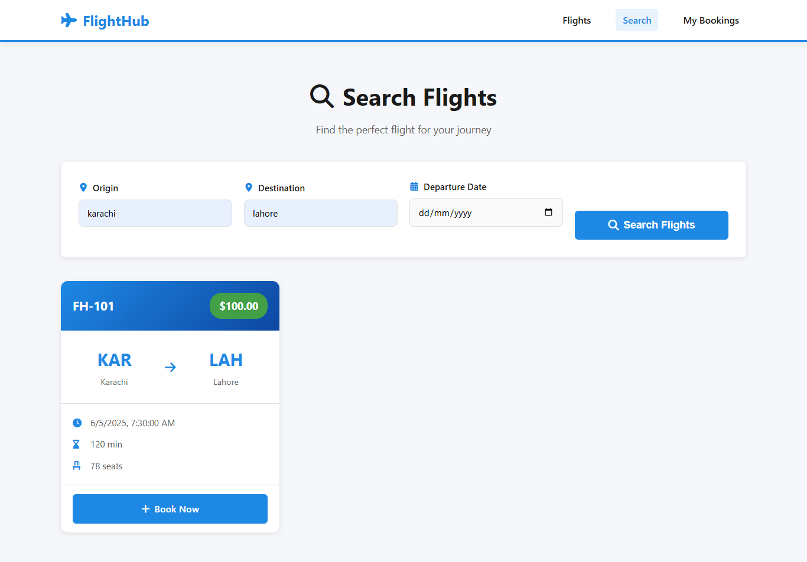
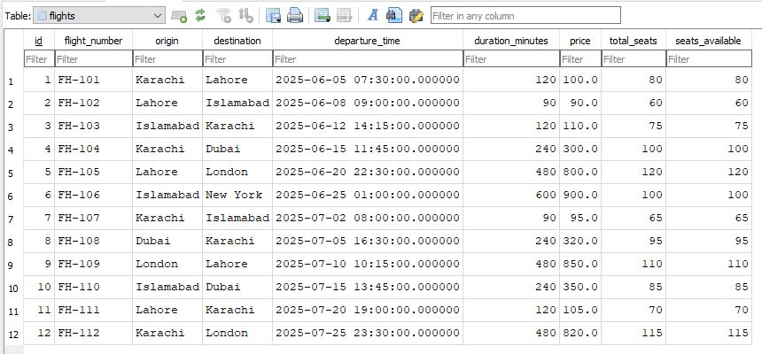
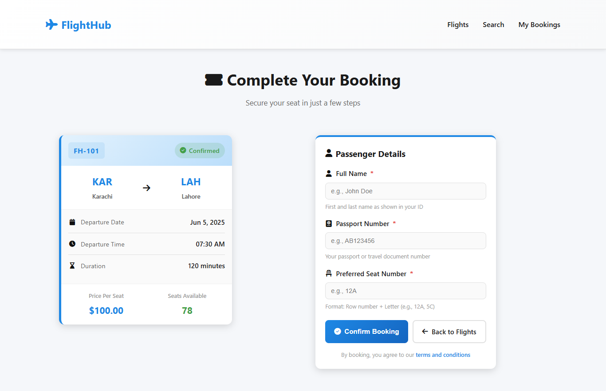

# FlightHub User Guide

## Overview

FlightHub is a flight booking system that allows users to:
- Browse available flights
- Search for flights by origin, destination, and date
- Book seats on flights
- View their bookings
- Cancel bookings

This guide demonstrates how to use both the web UI and the REST API.

---

## Prerequisites

Ensure the application is running:

1. Backend running on `http://127.0.0.1:8000`
2. Frontend running on `http://localhost:3000`
3. Database seeded with sample flights (run `python -m backend.seed`)

---

## Using the Web UI

### 1. View All Flights

**Navigate to:** `http://localhost:3000`

**What you'll see:**
- A homepage displaying a list of flight cards
- Each card shows:
  - Flight number (e.g., "FH-101")
  - Route (Origin → Destination)
  - Departure date and time
  - Duration in minutes
  - Price per seat (USD)
  - Available seats count
  - A "Book Now" button

**Example Card:**


**Figure 1:** FlightHub homepage with available flights     
```
┌─────────────────────────────────┐
│  FH-101                         │
│  Karachi → Lahore              │
│  2025-06-01 08:00              │
│  Duration: 75 minutes          │
│  Price: $120.00 per seat       │
│  Seats Available: 45           │
│  [Book Now]                    │
└─────────────────────────────────┘


```

---

### 2. Search for Flights

**Navigate to:** `http://localhost:3000/search`

**How to use:**
1. Enter **Origin** (e.g., "Karachi")
2. Enter **Destination** (e.g., "Dubai")
3. Enter **Departure Date** (e.g., "2025-06-01")
4. Click **Search**

**Example search:**
- Origin: `Karachi`
- Destination: `Dubai`
- Date: `2025-06-01`

**Result:**
- Displays matching flights in a table format
- Shows: Flight Number, Departure Time, Duration, Price, Seats Available
- Click "Book" to proceed to booking



**Figure 2:**   Search for Flights  
---

### 3. Book a Flight

**Navigate to:** `http://localhost:3000/book`

**How to book:**
1. Click **"Book Now"** on any flight card from the homepage
2. The booking page loads with the selected flight details displayed
3. Fill in the booking form:
   - **Passenger Name:** Full name (e.g., "John Doe")
   - **Passport Number:** Valid passport number (e.g., "AB123456")
   - **Seat Number:** Seat assignment (e.g., "12A", "45B")
4. Click **"Confirm Booking"**

**Example booking form:**
```
Flight: FH-101 (Karachi → Lahore)
Date: 2025-06-01 08:00
Price: $120.00 per seat

Passenger Name: ______________________
Passport Number: ______________________
Seat Number: ______________________

[Confirm Booking]  [Cancel]
```

**After successful booking:**
- You'll receive a **Booking Reference** (format: `FH-XXXXXX`)
- Example: `FH-A7C2E9`
- Save this reference for future cancellations


**Figure 3:**   Search for Flights  
---

### 4. View Your Bookings

**Navigate to:** `http://localhost:3000/bookings`

**How to search:**
- **Option A - Search by Name:**
  - Enter passenger name (e.g., "John Doe")
  - Click **Search**

- **Option B - Search by Reference:**
  - Enter booking reference (e.g., "FH-A7C2E9")
  - Click **Search**

**What you'll see:**
A table with columns:
- Booking Reference
- Flight Number
- Route
- Departure Time
- Passenger Name
- Seat Number
- Status (Confirmed/Cancelled)
- Cancel Button

---

### 5. Cancel a Booking

**From the Bookings page:**
1. Find your booking in the list
2. Click the **Cancel** button (trash icon)
3. Confirm the cancellation
4. Status updates to "Cancelled"
5. Seats on the flight are released and become available again

---

## Using the REST API (curl examples)

### Base URL
```
http://127.0.0.1:8000
```

### 1. Get All Flights

**Endpoint:** `GET /flights`

**Curl command:**
```bash
curl -X GET "http://127.0.0.1:8000/flights" \
  -H "accept: application/json"
```

**Response (200 OK):**
```json
[
  {
    "id": 1,
    "flight_number": "FH-101",
    "origin": "Karachi",
    "destination": "Lahore",
    "departure_time": "2025-06-01T08:00:00",
    "duration_minutes": 75,
    "price": 120.00,
    "total_seats": 80,
    "seats_available": 45
  },
  {
    "id": 2,
    "flight_number": "FH-102",
    "origin": "Lahore",
    "destination": "Islamabad",
    "departure_time": "2025-06-01T10:30:00",
    "duration_minutes": 50,
    "price": 100.00,
    "total_seats": 100,
    "seats_available": 67
  }
]
```



**Figure 2:** FlightHub Database
---

### 2. Search Flights

**Endpoint:** `GET /flights/search`

**Query Parameters:**
- `origin` (optional): Origin city
- `destination` (optional): Destination city
- `departure_date` (optional): Date in format YYYY-MM-DD

**Curl command:**
```bash
curl -X GET "http://127.0.0.1:8000/flights/search?origin=Karachi&destination=Dubai&departure_date=2025-06-15" \
  -H "accept: application/json"
```

**Response (200 OK):**
```json
[
  {
    "id": 4,
    "flight_number": "FH-104",
    "origin": "Karachi",
    "destination": "Dubai",
    "departure_time": "2025-06-15T14:00:00",
    "duration_minutes": 180,
    "price": 350.00,
    "total_seats": 120,
    "seats_available": 89
  }
]
```

**Error Response (400 Bad Request - no parameters):**
```json
{
  "detail": "Provide at least one search parameter: origin, destination, or departure_date."
}
```

---

### 3. Create a Flight (Admin Use)

**Endpoint:** `POST /flights`

**Request body:**
```json
{
  "flight_number": "FH-201",
  "origin": "Islamabad",
  "destination": "London",
  "departure_time": "2025-07-01T20:00:00",
  "duration_minutes": 480,
  "price": 850.00,
  "total_seats": 200
}
```

**Curl command:**
```bash
curl -X POST "http://127.0.0.1:8000/flights" \
  -H "Content-Type: application/json" \
  -d '{
    "flight_number": "FH-201",
    "origin": "Islamabad",
    "destination": "London",
    "departure_time": "2025-07-01T20:00:00",
    "duration_minutes": 480,
    "price": 850.00,
    "total_seats": 200
  }'
```

**Response (201 Created):**
```json
{
  "id": 13,
  "flight_number": "FH-201",
  "origin": "Islamabad",
  "destination": "London",
  "departure_time": "2025-07-01T20:00:00",
  "duration_minutes": 480,
  "price": 850.00,
  "total_seats": 200,
  "seats_available": 200
}
```

---

### 4. Book a Flight



**Figure 2:**   Book Flight  

**Endpoint:** `POST /bookings`

**Request body:**
```json
{
  "flight_id": 1,
  "passenger_name": "John Doe",
  "passport_number": "AB123456",
  "seat_number": "12A"
}


```

**Curl command:**
```bash
curl -X POST "http://127.0.0.1:8000/bookings" \
  -H "Content-Type: application/json" \
  -d '{
    "flight_id": 1,
    "passenger_name": "John Doe",
    "passport_number": "AB123456",
    "seat_number": "12A"
  }'
```

**Response (201 Created):**
```json
{
  "booking_reference": "FH-A7C2E9",
  "flight_id": 1,
  "passenger_name": "John Doe",
  "passport_number": "AB123456",
  "seat_number": "12A",
  "status": "confirmed",
  "created_at": "2025-06-01T09:15:30.123456",
  "flight": {
    "id": 1,
    "flight_number": "FH-101",
    "origin": "Karachi",
    "destination": "Lahore",
    "departure_time": "2025-06-01T08:00:00",
    "duration_minutes": 75,
    "price": 120.00,
    "total_seats": 80,
    "seats_available": 44
  }
}
```

**Error Response (409 - No seats available):**
```json
{
  "detail": "No seats available on this flight."
}
```

**Error Response (409 - Seat already taken):**
```json
{
  "detail": "Seat 12A is already taken on this flight."
}
```

---

### 5. View All Bookings (Search)

**Endpoint:** `GET /bookings`

**Query Parameters:**
- `name` (optional): Passenger name (partial match)
- `ref` (optional): Booking reference (exact match)

**Curl command (by name):**
```bash
curl -X GET "http://127.0.0.1:8000/bookings?name=John" \
  -H "accept: application/json"
```

**Curl command (by reference):**
```bash
curl -X GET "http://127.0.0.1:8000/bookings?ref=FH-A7C2E9" \
  -H "accept: application/json"
```

**Response (200 OK):**
```json
[
  {
    "booking_reference": "FH-A7C2E9",
    "flight_id": 1,
    "passenger_name": "John Doe",
    "passport_number": "AB123456",
    "seat_number": "12A",
    "status": "confirmed",
    "created_at": "2025-06-01T09:15:30.123456",
    "flight": {
      "id": 1,
      "flight_number": "FH-101",
      "origin": "Karachi",
      "destination": "Lahore",
      "departure_time": "2025-06-01T08:00:00",
      "duration_minutes": 75,
      "price": 120.00,
      "total_seats": 80,
      "seats_available": 44
    }
  }
]
```

**Error Response (400 - No parameters):**
```json
{
  "detail": "Provide at least one search parameter: name or ref."
}
```

---

### 6. Cancel a Booking

**Endpoint:** `DELETE /bookings/{reference}`

**Curl command:**
```bash
curl -X DELETE "http://127.0.0.1:8000/bookings/FH-A7C2E9" \
  -H "accept: application/json"
```

**Response (200 OK):**
```json
{
  "booking_reference": "FH-A7C2E9",
  "status": "cancelled",
  "message": "Booking FH-A7C2E9 has been successfully cancelled."
}
```

**Error Response (404 - Booking not found):**
```json
{
  "detail": "Booking FH-A7C2E9 not found."
}
```

**Error Response (400 - Already cancelled):**
```json
{
  "detail": "Booking FH-A7C2E9 is already cancelled."
}
```

---

## Quick Start Workflow

### Step 1: View Available Flights
```bash
curl -X GET "http://127.0.0.1:8000/flights"
```

### Step 2: Search for Specific Route
```bash
curl -X GET "http://127.0.0.1:8000/flights/search?origin=Karachi&destination=Dubai"
```

### Step 3: Book a Seat
```bash
curl -X POST "http://127.0.0.1:8000/bookings" \
  -H "Content-Type: application/json" \
  -d '{
    "flight_id": 4,
    "passenger_name": "Jane Smith",
    "passport_number": "XY987654",
    "seat_number": "25B"
  }'
```
*Note down the booking_reference from response*

### Step 4: View Your Booking
```bash
curl -X GET "http://127.0.0.1:8000/bookings?ref=FH-XXXXXX"
```

### Step 5: Cancel Booking (if needed)
```bash
curl -X DELETE "http://127.0.0.1:8000/bookings/FH-XXXXXX"
```

---

## Common Tasks

### Find a Flight for Tomorrow from Karachi to Lahore
```bash
# First, get today's date and calculate tomorrow
# Then search
curl -X GET "http://127.0.0.1:8000/flights/search?origin=Karachi&destination=Lahore&departure_date=2025-06-02"
```

### Check All My Bookings
```bash
curl -X GET "http://127.0.0.1:8000/bookings?name=John%20Doe"
```

### Try Booking the Same Seat (Will fail - seat taken)
```bash
curl -X POST "http://127.0.0.1:8000/bookings" \
  -H "Content-Type: application/json" \
  -d '{
    "flight_id": 1,
    "passenger_name": "Different Person",
    "passport_number": "CD111222",
    "seat_number": "12A"
  }'
```
*Expected: 409 Conflict - Seat already taken*

---

## API Status Codes

| Code | Meaning | Example |
|------|---------|---------|
| 200 | Success (GET, DELETE) | Flight search returned results |
| 201 | Created (POST) | Booking successfully created |
| 400 | Bad Request | Missing required parameters |
| 404 | Not Found | Flight or booking doesn't exist |
| 409 | Conflict | No seats available or seat taken |

---

## Notes

- All timestamps are in ISO 8601 format (UTC)
- Booking references follow format: `FH-XXXXXX` (6 random hex characters)
- Cancelling a booking immediately releases the seat for re-booking
- Search is case-insensitive for passenger names
- Seats are freed back to inventory when a booking is cancelled

---

## Troubleshooting

**Issue:** "Flight not found"
- **Solution:** Check the flight_id exists by running `GET /flights` first

**Issue:** "Seat already taken"
- **Solution:** Choose a different seat number or check available flights

**Issue:** "No seats available on this flight"
- **Solution:** Select a different flight with available seats

**Issue:** API returns 404 for a booking reference
- **Solution:** Verify the exact booking reference (case-sensitive, must start with "FH-")
